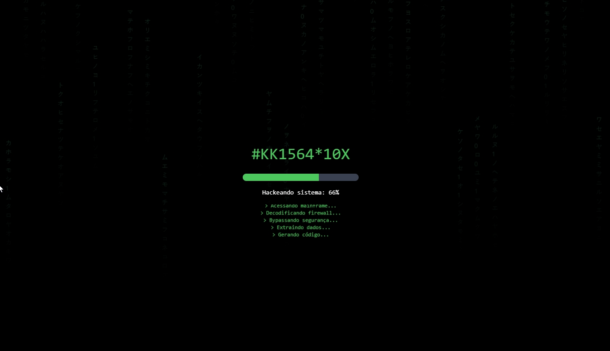

# Matrix Hacker Slots

Utilize essa página como funil para encaminhar leads para seu cassino ou casa de apostas!
A aplicação possui uma página simples carregando códigos aleatórios com porcentagens de ganho e promoções de depósitos.

Para um melhor desempenho, e segurança utilize a hospedagem na Hostinger através deste link: [https://hostinger.com.br](https://hostinger.com.br?REFERRALCODE=1DANIEL1306)

# Doação

Para fazer uma doação em agradecimento pelo projeto! Acesse: [https://roxcheckout.shop](https://roxcheckout.shop)

### Deploy
Aplicação em produção [https://daanrox.github.io/Matrix-Hack-Slots/](https://daanrox.github.io/Matrix-Hack-Slots/)

## Tecnologias Utilizadas

O site foi desenvolvido utilizando as seguintes tecnologias:

  
  
  
  
  

Não foi utilizado nenhum framework ou biblioteca para o desenvolvimento deste projeto.

## Contato
Se tiver dúvidas ou precisar de mais informações, sinta-se à vontade para entrar em contato:
- Email : [contato@daanrox.com](mailto:contato@daanrox.com)
- LinkedIn: [https://www.linkedin.com/in/daanrox/](Daanrox)

--- 

Projeto desenvolvido para um cliente especialista em iGaming
